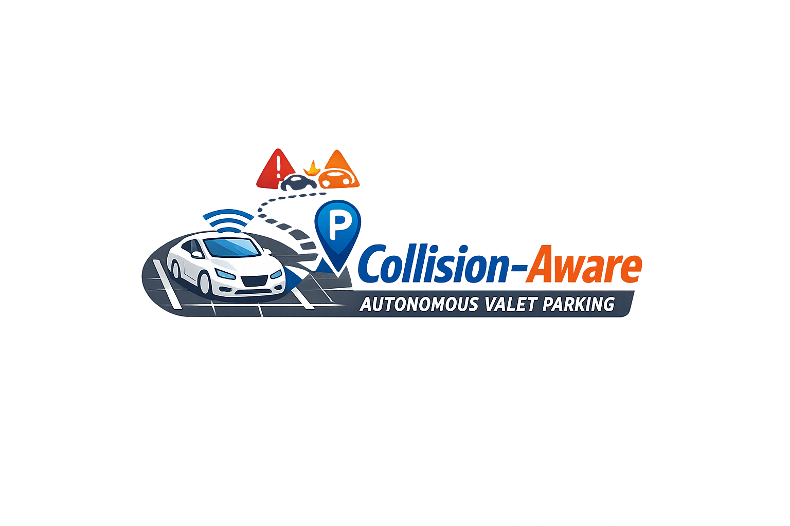

# Autonomous Valet Parking Simulation and Planning Stack

  

Research software for real-time multi-vehicle valet-parking experiments using CARLA, CommonRoad, CommonRoad-Reach, Hybrid A*, occupancy grids, and ZeroMQ.

[Watch the demonstration video](docs/media/master_thesis_final_video.mp4) · [Portfolio case study](https://ajayc.dev/) · [Full setup guide](docs/SETUP.md) · [Archived variants](docs/BRANCHES.md)

## This snapshot

| Field | Value |
|---|---|
| Archive branch | `thesis/commonroad-scene` |
| Variant | Early scene-generation and synchronization snapshot |
| CARLA map | `valet_parking` |
| Python | 3.10 |
| CARLA | 0.9.15 source build, recorded revision `8e623cb41` |

Cooked assets are archived; the exact matching RoadRunner FBX export was not present in this checkout.

## What the project demonstrates

- Captures live CARLA vehicle and obstacle state and converts it into CommonRoad planning scenarios.
- Computes reachable sets and rasterized occupancy grids for conflict prediction.
- Detects overlapping spatiotemporal occupancy between multiple vehicles.
- Uses Hybrid A* and branch-specific decision strategies to update trajectories.
- Synchronizes simulated vehicles and shares state through ZeroMQ.
- Preserves several thesis experiments as separate branches instead of flattening them into one misleading implementation.

## System flow

~~~text
CARLA 0.9.15 + custom map
        |
        v
scene capture and CommonRoad conversion
        |
        v
route / reachable-set / occupancy-grid generation
        |
        v
multi-vehicle conflict detection
        |
        v
decision strategy + Hybrid A* replanning
        |
        v
CARLA controllers and ZeroMQ synchronization
~~~

## Quick start

This is not a pip-only project. The custom map and Python API were produced with a CARLA 0.9.15 source build. Read [the complete reproduction guide](docs/SETUP.md) before installing.

~~~bash
git clone https://github.com/TheCez/multi-vehicle-valet-parking-v2i.git
cd multi-vehicle-valet-parking-v2i
git switch thesis/commonroad-scene

python3.10 -m venv .venv
source .venv/bin/activate
python -m pip install --upgrade pip
python -m pip install -r requirements.txt
python -m pip install Carla_module/carla-0.9.15-cp310-cp310-linux_x86_64.whl
~~~

Install or import `valet_parking`, start the CARLA server, and then run:

~~~bash
python automatic_control.py --sync
~~~

The matching `.umap`, `.uexp`, and `.xodr` files are under `carla_map/Maps/`. Where available, the RoadRunner source package is under `carla_map/source/`. Keep the cooked files together when copying them:

~~~bash
export CARLA_INSTALL=/absolute/path/to/CARLA_0.9.15
cp -a carla_map/Maps/. "$CARLA_INSTALL/CarlaUE4/Content/Carla/Maps/"
~~~

If the map is not registered by a packaged CARLA build, import the supplied FBX/OpenDRIVE source through the pinned CARLA source checkout as described in [docs/SETUP.md](docs/SETUP.md).

## Repository guide

- `CommonRoadSceneGenerator.py` and `carla_getter.py`: CARLA-to-CommonRoad scene generation.
- `synchroniser/`: simulation coordination and decision logic.
- `conflict_solver/`: conflict detection and resolution.
- `occupation_grid/`: occupancy-grid generation.
- `hybid_a_star_agent/`: Hybrid A* planning integration.
- `Carla_module/`: archived CPython 3.10 CARLA wheel.
- `runtime_patches/`: only the modified CARLA/CommonRoad runtime files and patches.
- `carla_map/`: branch-specific source and cooked map assets.
- `docs/media/`: project logo and demonstration video from the portfolio.

## Research status

This repository is an archival research snapshot from the master's thesis “Computation and Validation of Occupancy Grids for Solving Traffic Conflicts in Multi-vehicle Trajectory Planning.” It is presented for reproducibility and technical review, not as a production autonomous-driving system.
